# HW: Week 1

## Shen-Shen W:

Original:

Recreation:

Dots, Lines, and Forms by Hassan Sharif 1984 - [Recreation/Process](http://recreating-the-past.s3-website-us-east-1.amazonaws.com/week1/index.html) - [Code](https://github.com/wushenshen/recreating-the-past/blob/main/week1/sketch.js)

## Matthis G:

Original:

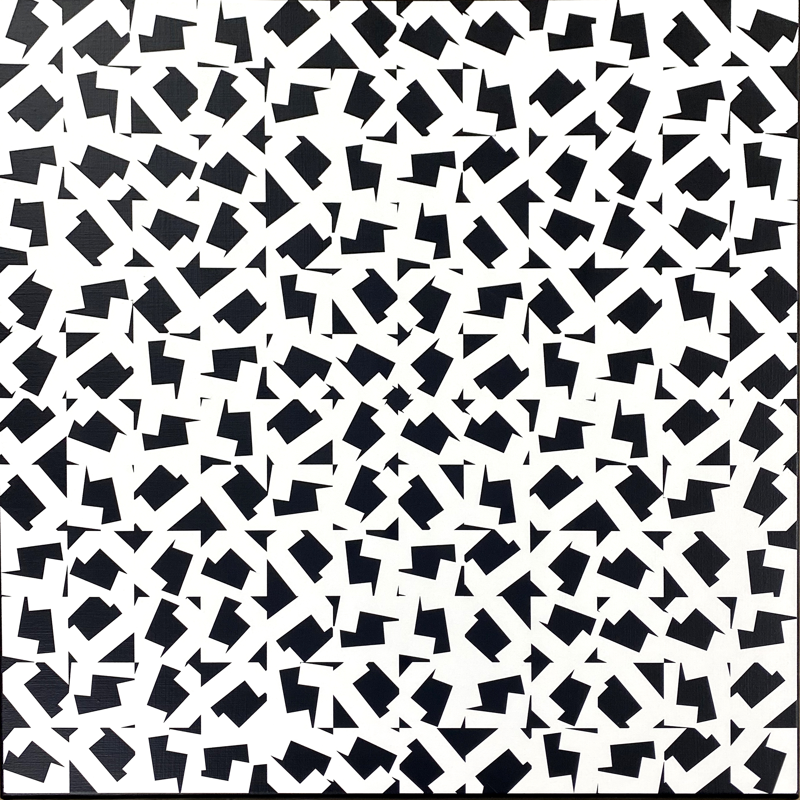

Recreation:

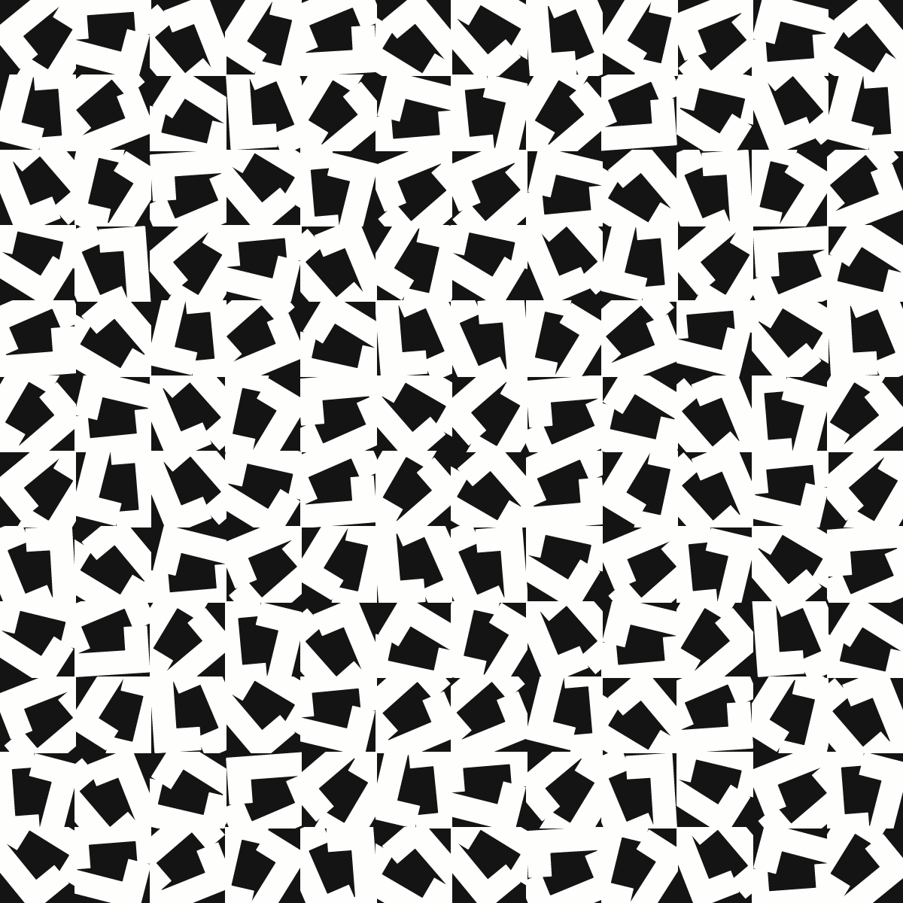

[Vera Molnar: Structure a Partir de la Lettre U/C](https://www.matthisgrunsky.ca/rtp/week1_molnar/)

## Yadira S:

A mix of [(Dés) Ordres](https://generativelandscapes.wordpress.com/2019/04/09/pattern-based-on-vera-molnars-des-ordres-series-1974-algorithm-21-01/) & [Hommage à Barbaud](https://spalterdigital.com/artworks/hommage-a-barbaud-no-5-a-8/) ? with colours - [interactive output](https://trinket.io/python/ccad7380c5)

Vera Molnar’s “Shall we take a walk?” materialized as e-textile with my own recreation of  neural networks in pink and orange nodes interconnected to highs and lows in the “walk”.

## Lillian-Yvonne:

[Vera Molnar’s “Two Rectangles” (1949), “Inclinaisions” (1971), and “Untitled” (1952)](https://github.com/lllyyybbb/SFPC-Recreating-the-Past-2021/tree/main/Week%201%20Homework)

## Mauricio Román:

[Vera Molnar “ 1 % de Désordre bleu et rouge (C)”](https://github.com/mauricixx/SFPC-RTP-F21/tree/gh-pages/W01)  1979

## Heidi He:

Original:

Recreation:

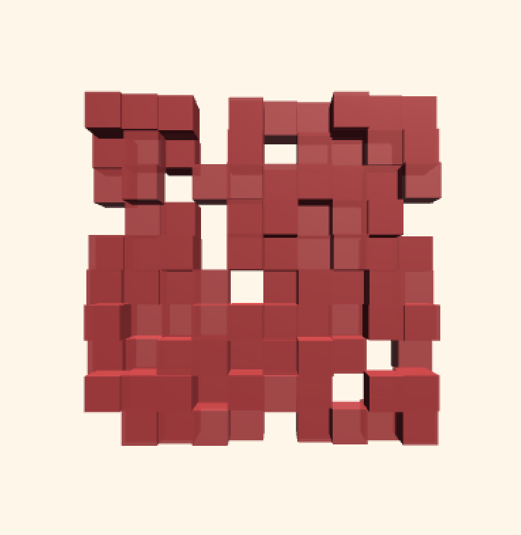

[Recreating Vera Molnar’s](https://github.com/HeidiHe/RecreatingThePast/blob/main/README.md#week-1-vera-molnar) [199039 Déhancement (1990)](https://github.com/HeidiHe/RecreatingThePast/blob/main/README.md#week-1-vera-molnar)

## Kate Yourke:

Original:

Recreation:

*Trapèzes inscrits 1/5, 1974* [+Turtle Stitch detail of Trapèzes inscrits](https://paper.dropbox.com/doc/Turtle-Stitch-detail-of-Trapezes-inscrits-U4ykRS1UzvmhF6uoGoP5F)

## Jenna Murphy:

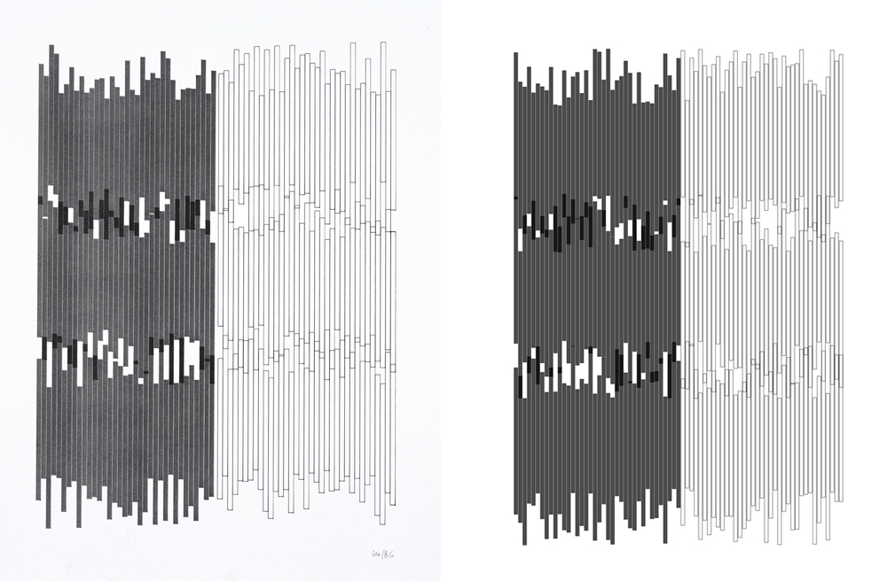

[Vera Molnar, Series Gothique, 1986](https://github.com/jennamurphymcad/SFPC_Fall_21/tree/main/week1/My%20Working%20Files/VeraMolnar)

## Anna Rulloda:

Original:

Recreation:

[Hassan Sharif, Iron No. 3 - Hassan Sharif, 2020](https://github.com/phalaenopsis27/RecreatingThePast)

## Luca:

Original:

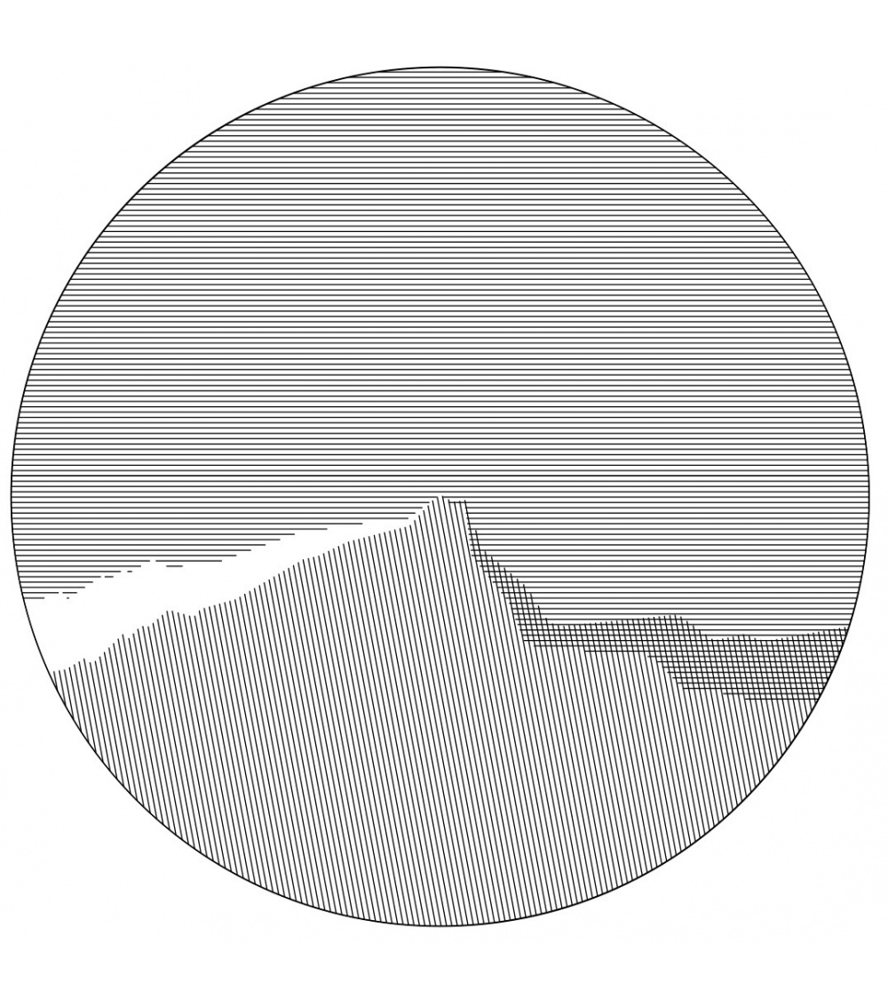

Recreation:

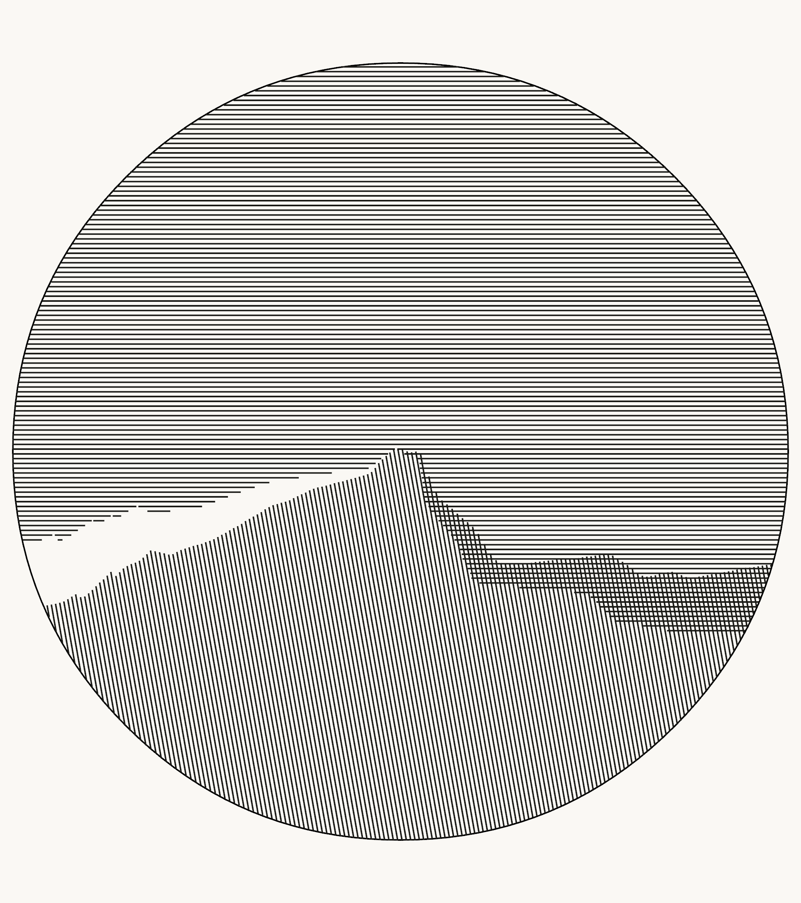

Vera Molnár, Sainte-Victoire en rond.

- [Images](https://twitter.com/photon_garden/status/1455414543505629186)
- [Process and analysis](https://twitter.com/photon_garden/status/1455414507698806784)
- [Code](https://github.com/photon-garden/recreating-sainte-victoire-en-rond)

## Hiroyuki:

Original:

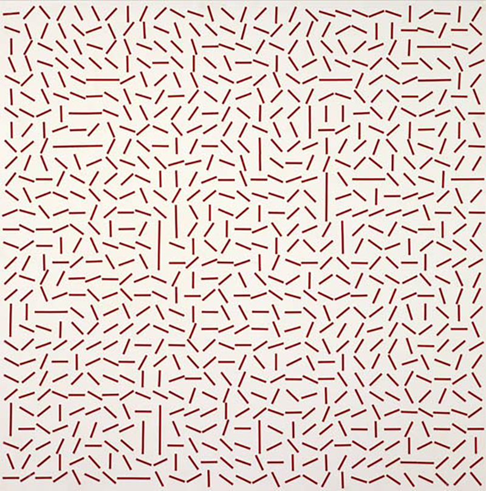

Recreation:

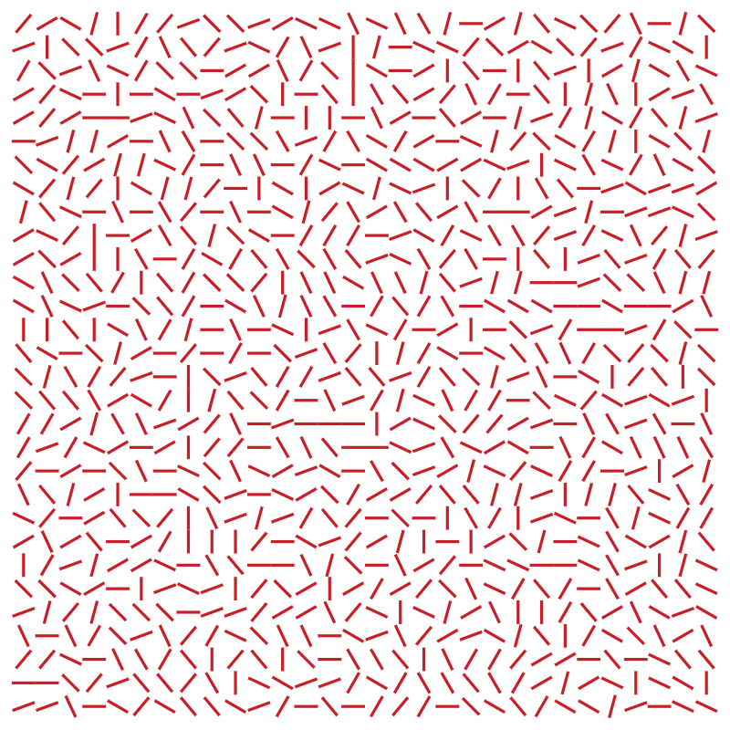

[+Vera Molnár, Lent mouvement giratoire, 1957](https://paper.dropbox.com/doc/Vera-Molnar-Lent-mouvement-giratoire-1957-msee1hHsC3YdekyVBI634)

## Salem:

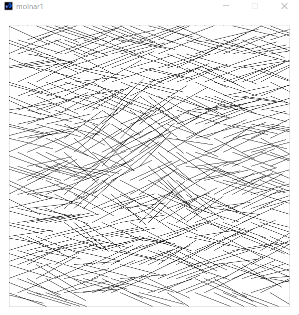

[Vera Molnar, Meules en hommage à Claude Monet-A, 2013](https://roamresearch.com/#/app/salem-public-graph/page/grS4B7W1L)

## Ladan:

Original:

Recreation:

[Vera Molnar: Vera Molnar, Meules en hommage à Claude Monet-A, 2013](https://github.com/ladan-b/class/blob/7d0cfe61490535125c3eced9713dd5da3b245e87/README.md)

## Sara K:

Original:

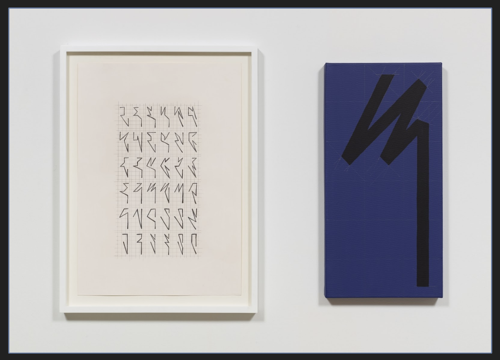

Recreation:

[Seven Points - Hassan Sharif](https://www.notion.so/RTP-HW1-Hassan-Sharif-c76a4d835d49477c9e02ab78fbf1512b)

## Michelle:

[Vera Molnar, Self Portrait](https://github.com/mimilei/rtp_sfpc_f21/blob/main/week1/bin/data/img/portrait_1.png) | [Code](https://github.com/mimilei/rtp_sfpc_f21/tree/main/week1)

Original:

Recreation:

## Maya/Embaci:

[Vera Molnar,](https://mimiworks.tumblr.com/post/666751795277791232/recreating-9)  [*9 ronds, 3 couleurs,*](https://mimiworks.tumblr.com/post/666751795277791232/recreating-9) [1966.](https://mimiworks.tumblr.com/post/666751795277791232/recreating-9)

## Hermann:

Original:

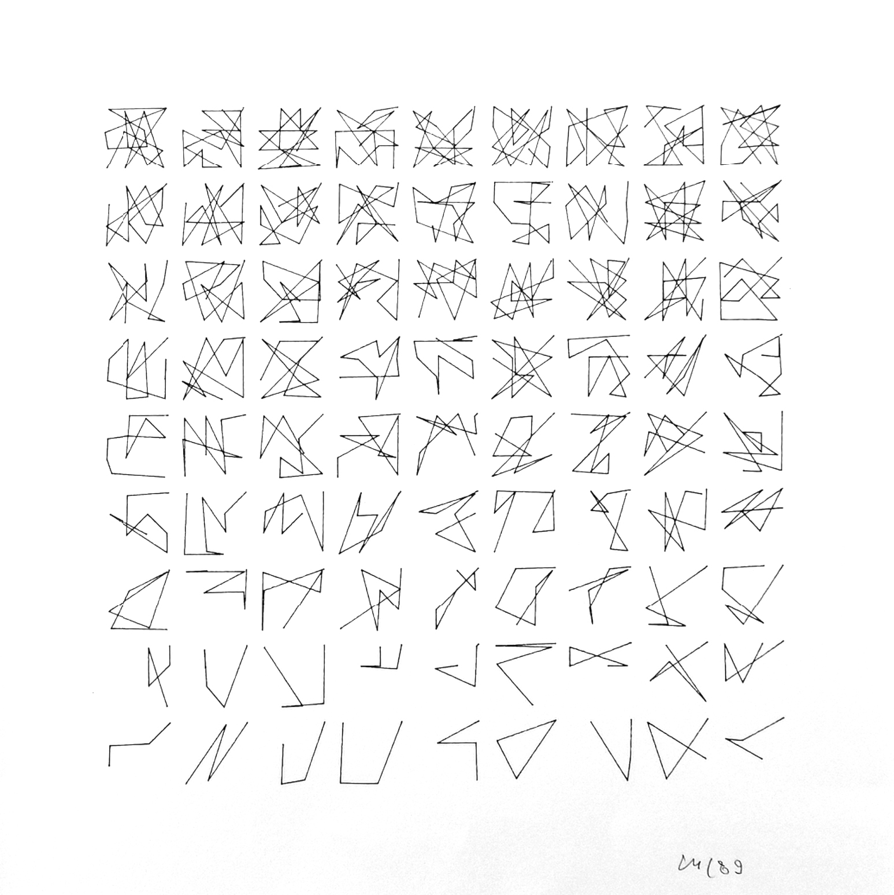

Recreation:

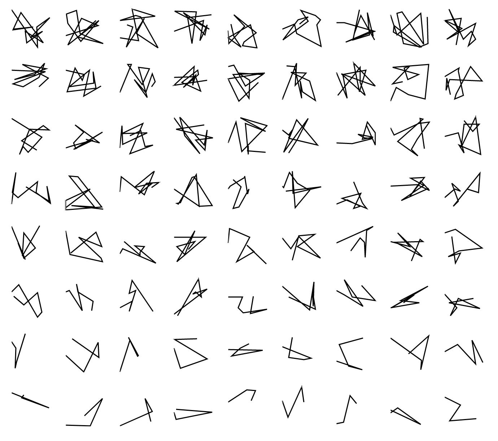

[Vera Molnar:](https://observablehq.com/@hzschie/disparition) [**Disparition**](https://observablehq.com/@hzschie/disparition)
[Vera Molnar:](https://observablehq.com/@hzschie/structure-a-partir-de-la-lettre-u) [**Structure à partir de la lettre U**](https://observablehq.com/@hzschie/structure-a-partir-de-la-lettre-u)

## Joanne:

[En 4 Couleurs, D’un Seul Trait](https://www.notion.so/Chaos-and-Order-1b4623bff8df49ec9c37f7016dec66e6), Vera Molnár

## Sara M:

Picture of Vera Molnar's piece: Shall We Take A Walk? Projection of a line drawn around the walls in a random manner

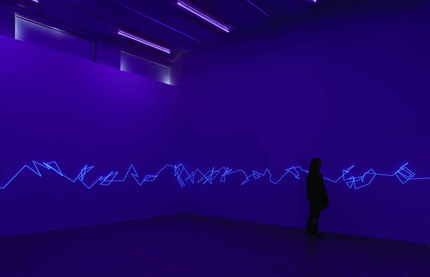

Animated gif of coding output - a line is drawn across the canvas in a random manner

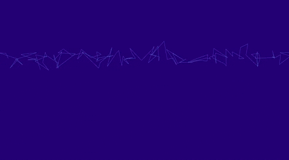

[Shall we take a walk](https://github.com/identikitten/vera-molnar-recreation) - Vera Molnar
