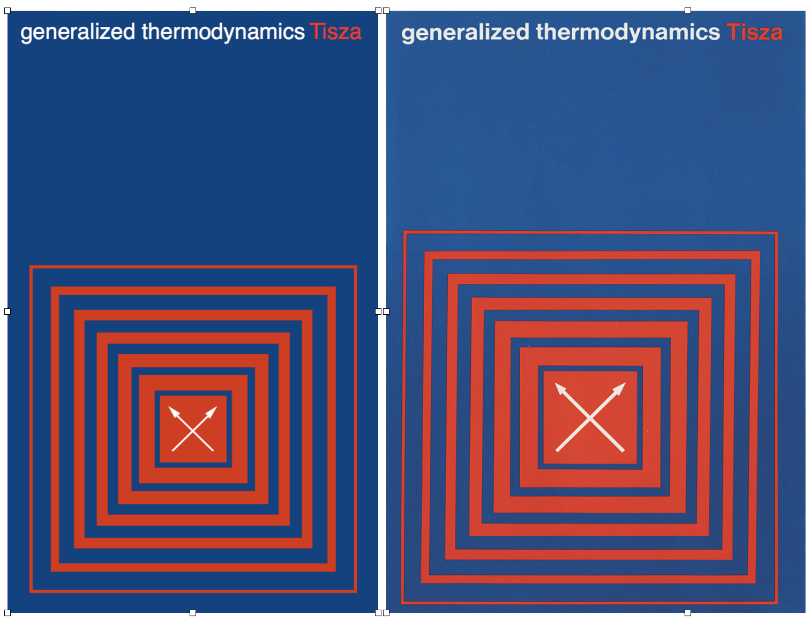
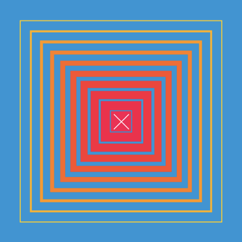
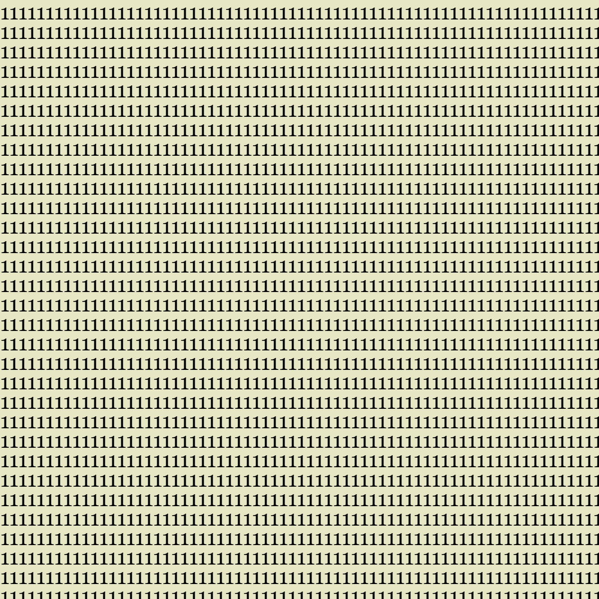
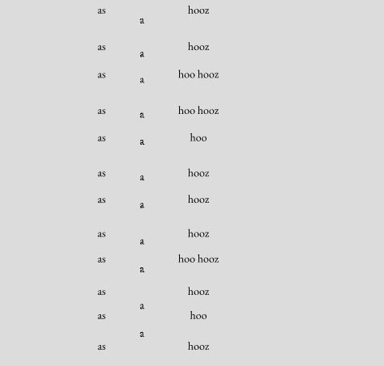
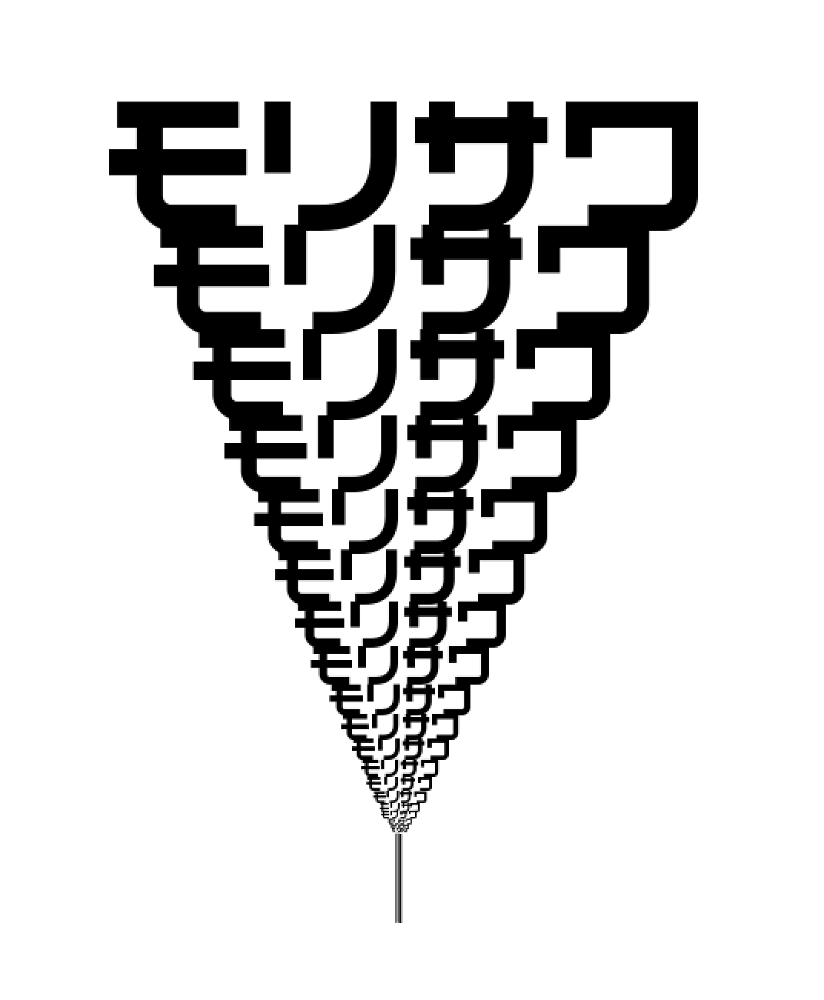
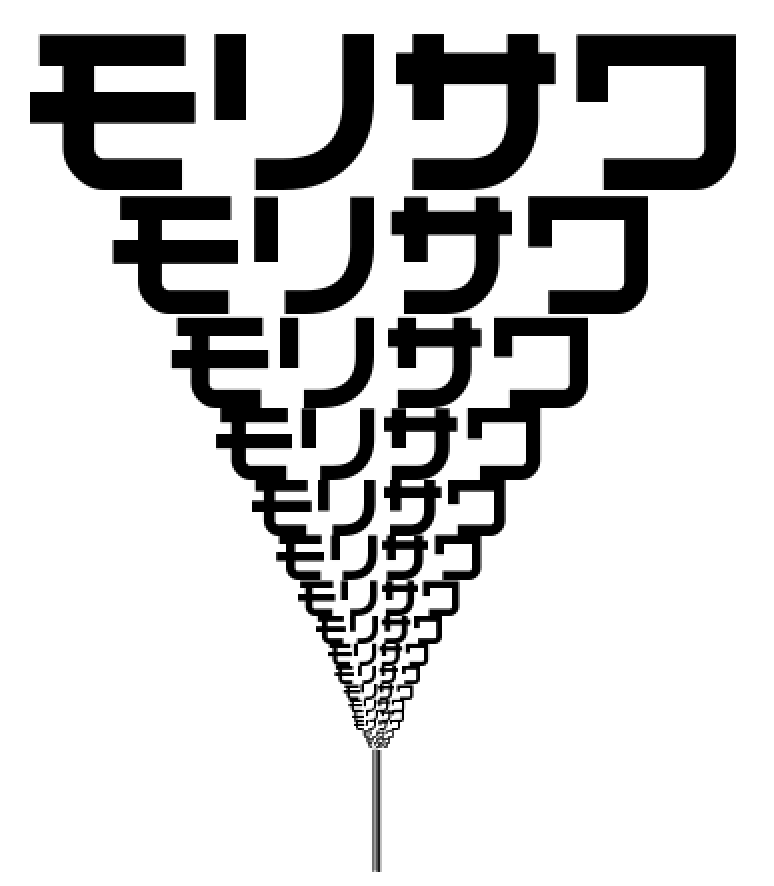
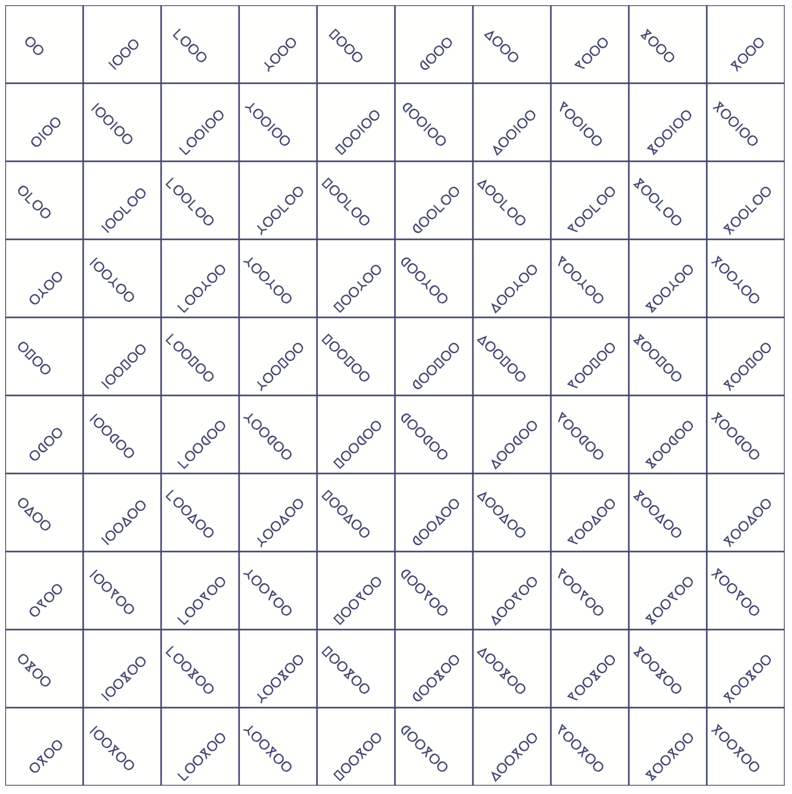
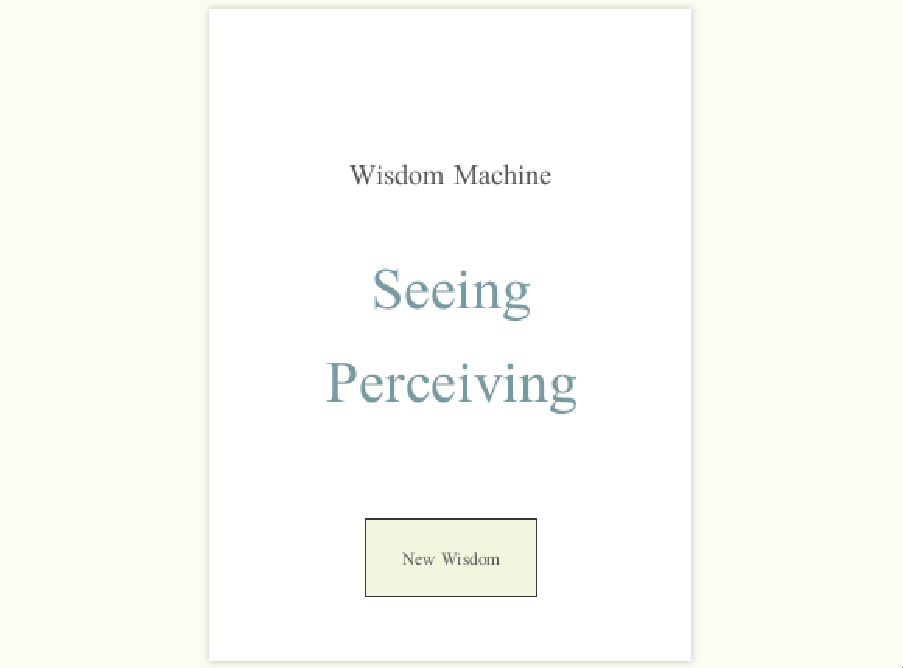
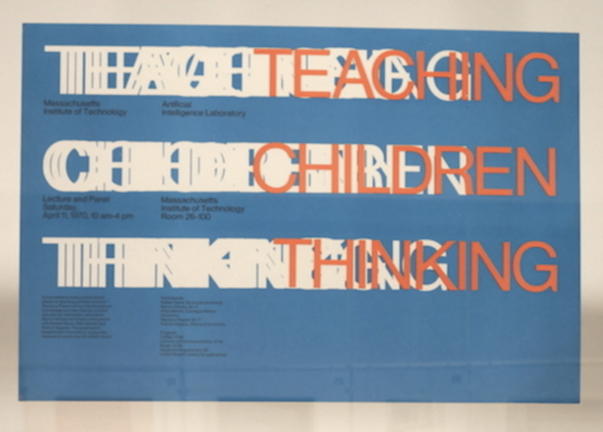
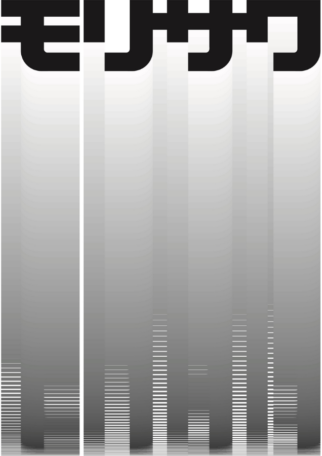

# HW_ Week 3

## Kate Y:

Clearly this is not exact, but my tweaking stamina wore out:
https://editor.p5js.org/kateyourke/sketches/_fkii7_LN

Attempting to use math to change size and fill values:
https://editor.p5js.org/kateyourke/sketches/ky0tDc63B

Adding movement, messing around with alpha values:
https://editor.p5js.org/kateyourke/sketches/Eey0KfAgm

## Lillian-Yvonne:

I recreated (in p5.js) some pages from [N. H. Pritchard’s](http://eclipsearchive.org/projects/ECHOES/html/pictures/001.html) [*EECCHHOOEESS.*](http://eclipsearchive.org/projects/ECHOES/html/pictures/001.html) It’s fairly simple stuff, but it aligns with my commitment to focus computational work on/towards Black writers and artists.

[N.H. Pritchard’s “1s”](https://github.com/lllyyybbb/SFPC-Recreating-the-Past-2021/blob/main/Week%203:%20Typography/Pritchards1s.js):

[N.H. Pritchard’s “FROG”](https://github.com/lllyyybbb/SFPC-Recreating-the-Past-2021/blob/main/Week%203:%20Typography/PritchardsFROG.js):

And for fun, I made a brand with a similar aesthetic.

## Matthis:

I made reproductions of 4 of John Maeda’s “12 o’clocks”, taking a few creative liberties along the way. My gif is looking a little weird and slow, but the link to the full window sketch should work better.  Click anywhere on the screen to advance to the next clock.

Original:

Reproduction:

[originals](http://cmuems.com/2016/60212/lectures/lecture-09-09b-clocks/maedas-clocks/)
[view in full window](https://www.matthisgrunsky.ca/rtp/week3_maeda/)
[view with code](https://editor.p5js.org/PTTScreen/sketches/wyzvIWp9n)

## Jenna Murphy:

I first did a reproduction of Muriel Cooper’s Multiple Interaction book cover. I was then drawn to the Mary Ellen Solt poem Geranium. Works were created with p5.js. See pieces/links below:

[Link to Live Code](https://editor.p5js.org/jennamurphymcad/sketches/NowqQSnnI)

[Link to Live Code](https://editor.p5js.org/jennamurphymcad/sketches/gGQOWr1uh)

## Luca:

My partner was sick this week and needed lots of love and support, so I aimed for something simple. I decided on Muriel Cooper’s cover for *The Mathematical Sciences*, which is beautiful and also has a nice optical illusion. Sometimes the top-right grid looks like it’s in front, and sometimes the bottom-left grid looks like it’s in front.

[Source code](https://github.com/photon-garden/recreating-the-mathematical-sciences)

Original:

Recreation:

## Heidi He:

I tried p5 this week for the first time and I recreated the simple but elegant MIT press logo from Muriel Cooper. I tried applying the style in texts and those are the derivation for “Heidi” and “SFPC”
[Link to my project](https://github.com/HeidiHe/RecreatingThePast/blob/main/README.md#week-3-murial-cooper)

## Sara M:

I recreated a poem from N. H. Pritchard’s [Eecchhooeess](http://eclipsearchive.org/projects/ECHOES/Echoes.pdf). I played around with it  and explored different ways to present a text. Links:

[As a (txt file)](https://editor.p5js.org/identikitten/sketches/Ej1TSoC9Y) - You can click on this and it will shuffle the phrases around. Contains the whole poem.

[As a (close up)](https://editor.p5js.org/identikitten/sketches/qW-ZqkB4K) - Pictured in the gif. Contains a fragment of the poem.

[As a (circular motion)](https://editor.p5js.org/identikitten/sketches/8V11AKn-n) - The poem moving around in space. Contains a fragment.

## Anna R:

## Hiroyuki:

[John Maeda, Morisawa 10, 1996](https://paper.dropbox.com/doc/Recreating-the-Past-SFPC-Fall-2021-msee1hHsC3YdekyVBI634#:uid=273424177305843665030998&h2=John-Maeda%2C-Morisawa%2C-1996)

Original:

Recreation:

## Michelle:

Recreation:

## Joanne:

I tried to recreate Nedim Kufi’s Mind storming digital grid using p5.js. I experimented a bit more by using Alibata (indigenous Filipino alphabet). I've filled each box with Alibata which says "pa rin," a suffix often used to mean "remains" or "still", to convey that there are countless ways to digest the last 100 years, but the objective truth remains uncertain (and maybe unimportant).

Code, process: https://dazzling-record-094.notion.site/Computational-Typography-63fee88e656f47c8826f2827c658d8e4

[Video](../media/rtp-3.mov)

## Hermann Z:

https://observablehq.com/d/474a5d953d89508f

## Maya C:

[**Recreating ON MODERNISM Cover design by Muriel Cooper for MIT Press, 1967**](https://mimiworks.tumblr.com/post/668026117238800384/recreating-on-modernism-cover-design-by-muriel)

## Sara K:

**Nedim Kufi**

This is a WIP still, while I succeeded in recreating the interface and centering the text. I couldn’t put the dataset and pull out different phrases yet… [Process](https://marsh-decimal-511.notion.site/RTP-HW3-Nedim-Kufi-122598c417eb493ba109189453449923) ;

Original:

Recreation:

## Mau:

Muriel Cooper - Teaching Children Thinking.
code: https://editor.p5js.org/mau/sketches/yOVmSA0Ka
[play with the slider :) ]

Original:

Recreation:

## Ladan B:

John Maeda, Morisawa

Recreation:

## Yadira S:

Yadira - palabras de liberacion
