# HW_ Week 4

## Matthis:

Bridget Riley - *Hesitate* (1964) // [Code](https://editor.p5js.org/codingsketchbook/sketches/mlo3aDbU5) // [Animated](https://editor.p5js.org/codingsketchbook/sketches/C3FatFlEf)

Original:

Recreation:

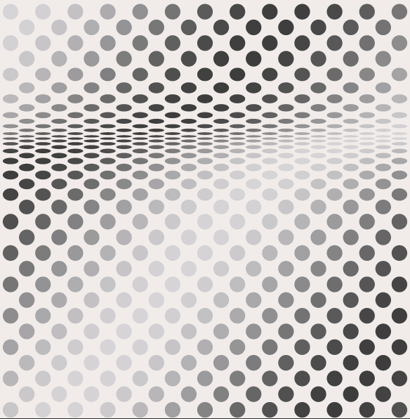

## Michelle Chang

[Phantom - Odili Donald Odita](https://www.artsy.net/artwork/odili-donald-odita-phantom)

Original:

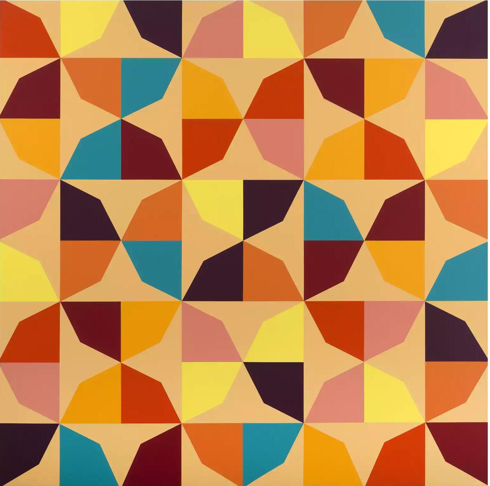

Semi-recreation. The outer frame and colors are randomized (I realized too late that there’s actually some logic to the outer frame).

Here, the tile orientation and colors are completely randomized according to MouseX.

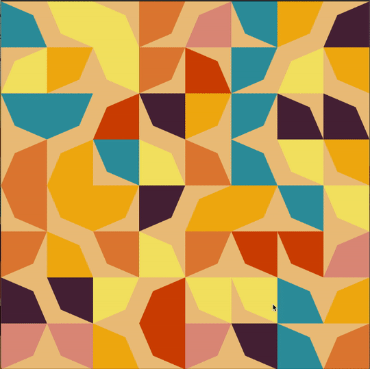

I was originally trying to rotate the same tile to copy Odita’s piece, but don’t think I really understood how the rotation function works. Looks like it’s 3D space only. But the results are fun!

This is randomized rotation around the Y axis, but if you try the Z axis, you get a cool falling leaf effect. :D

## Lillian-Yvonne:

Recreation of Odili Odita’s “Displacement” (I think that’s what it’s called?)

Original:

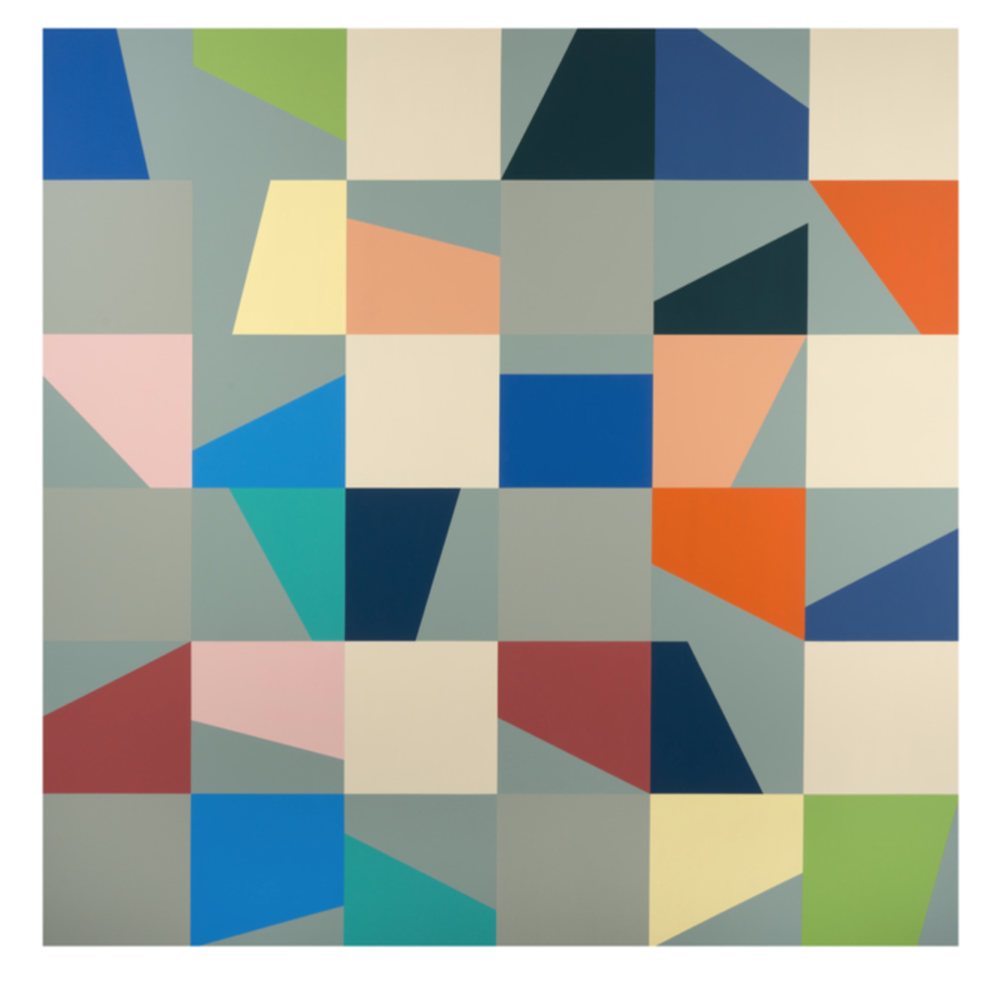

First as a hand-sketch:

[Recreation in p5.js (Live Code)](https://editor.p5js.org/lllyyybbb/sketches/2ka8h51W6)

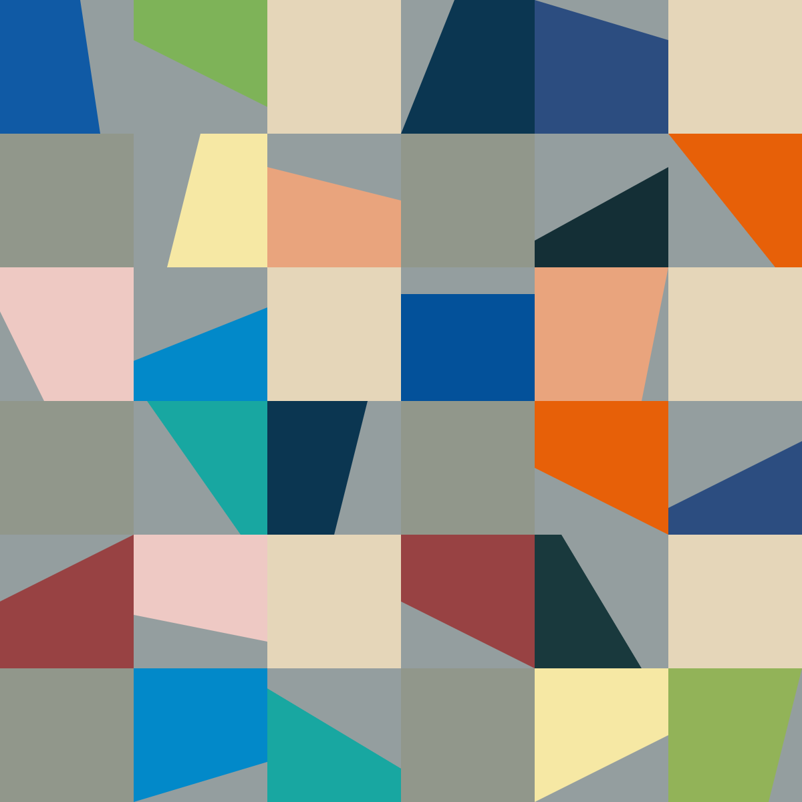

## Yadira S:

an attempt unfinished (I want to finish it) c[ombo recreation in p5.js](https://editor.p5js.org/yadlra/sketches/fTyD8taou) of Anni Albers threeply weave and a woven dress from Oaxaca :

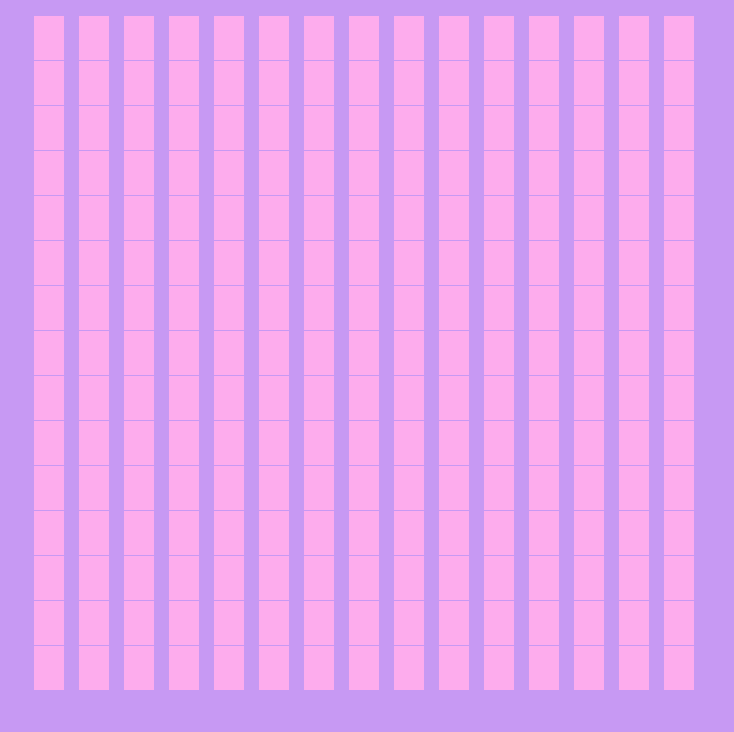

## Jenna Murphy:

Bridget Riley, Opening (1961) ([Live Code](https://editor.p5js.org/jennamurphymcad/sketches/pVP1p01TL))

Recreation:

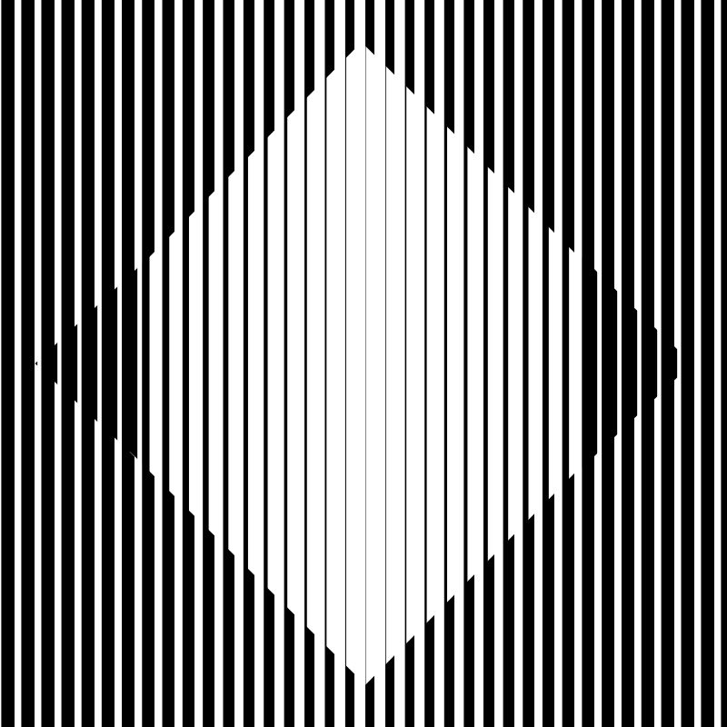

Original:

## Ladan Bahmani:

Anni Albers (Epitaph) / (still in-progress)

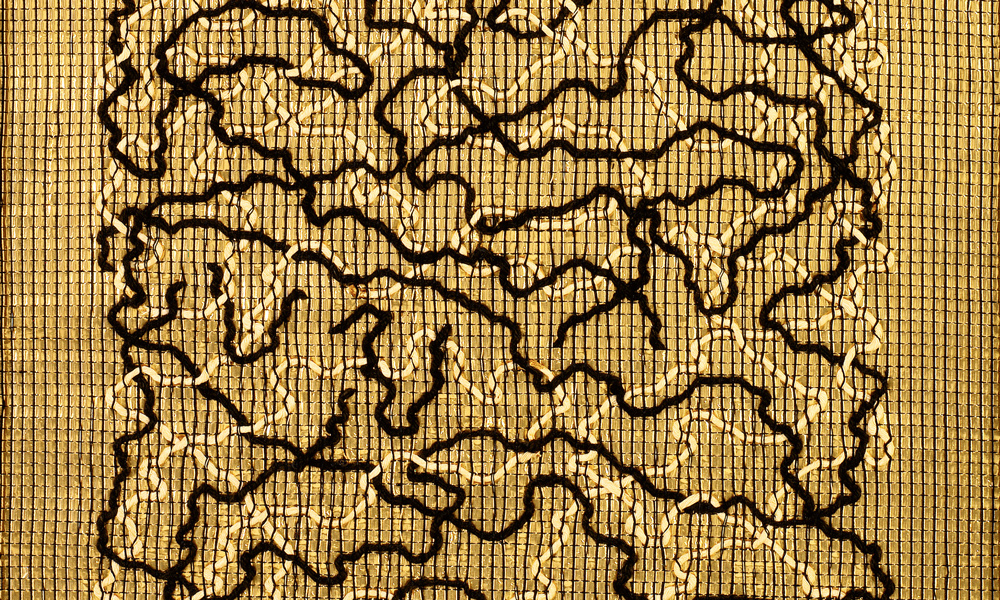

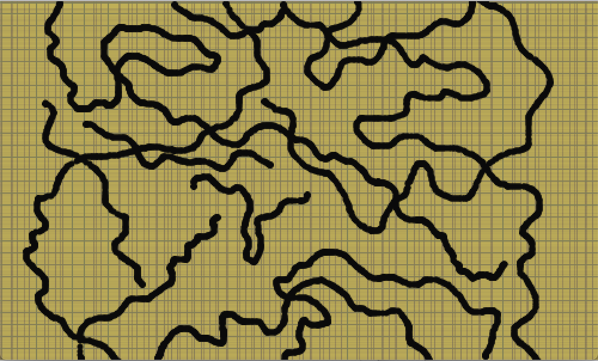

## anna rulloda

Original:

Recreation:

## Maya Charles

https://mimiworks.tumblr.com/post/668658938472005632/recreating-anni-josef-albers-equal-and-unequal

## Heidi He

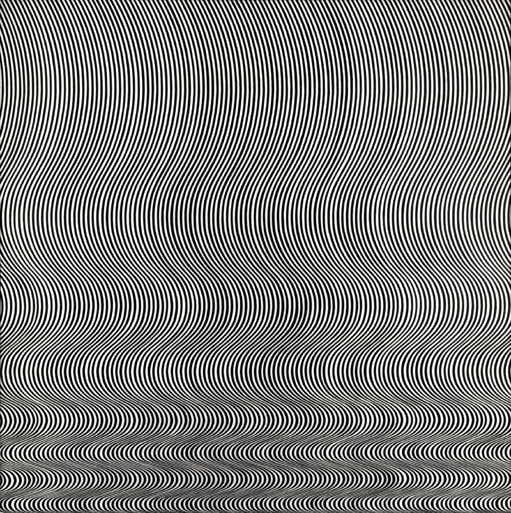

## Joanne

Recreation:

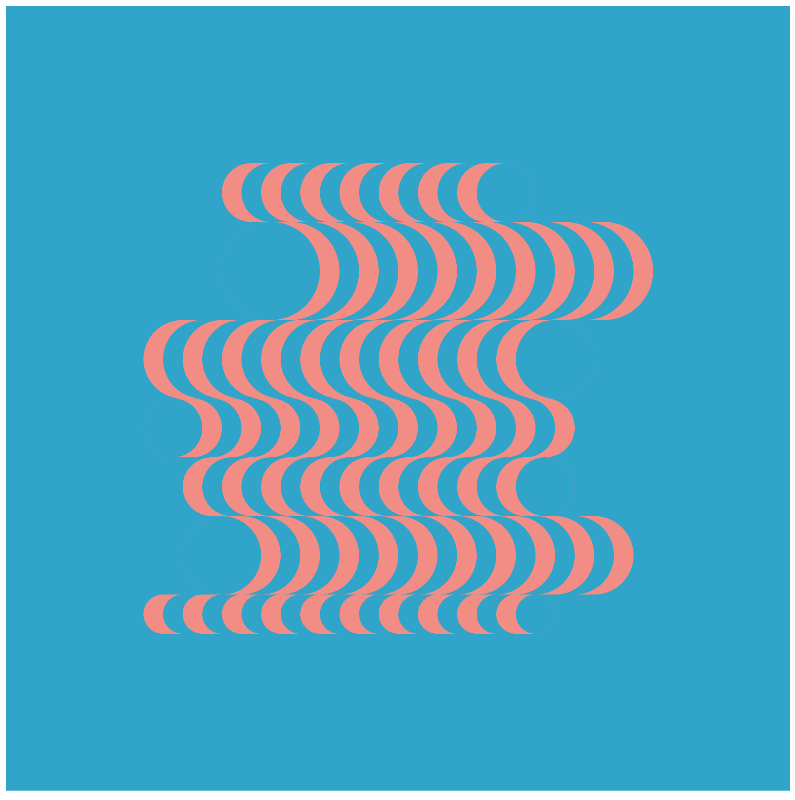

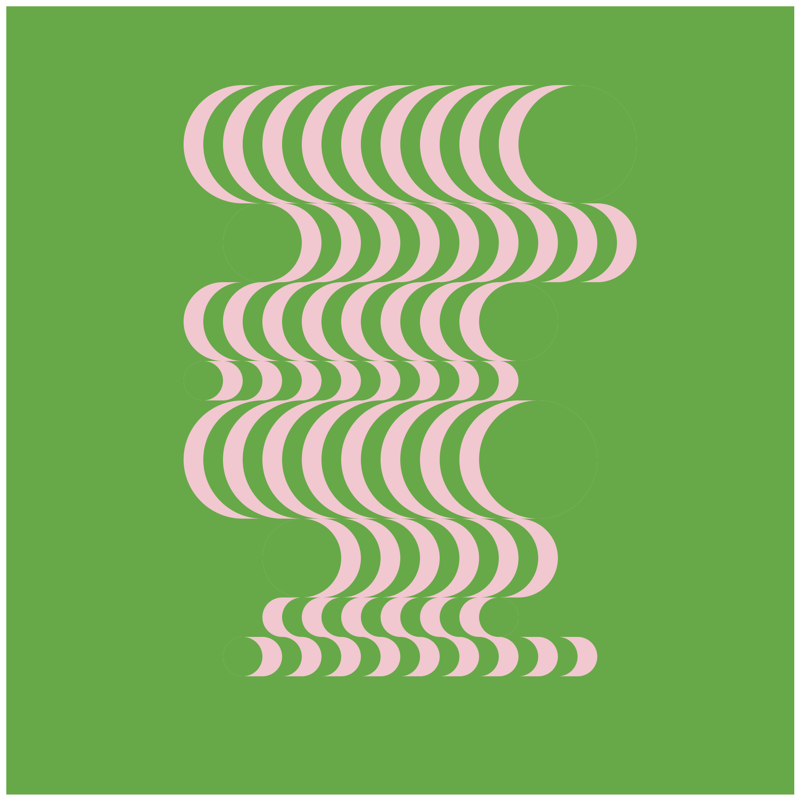

https://dazzling-record-094.notion.site/Patterns-3c549891ed2c4d13ba7723c133f7b641

## Luca:

Blaze (1964) by Bridget Riley. Here’s my [code](https://github.com/photon-garden/recreating_blaze).

Original:

Recreation:

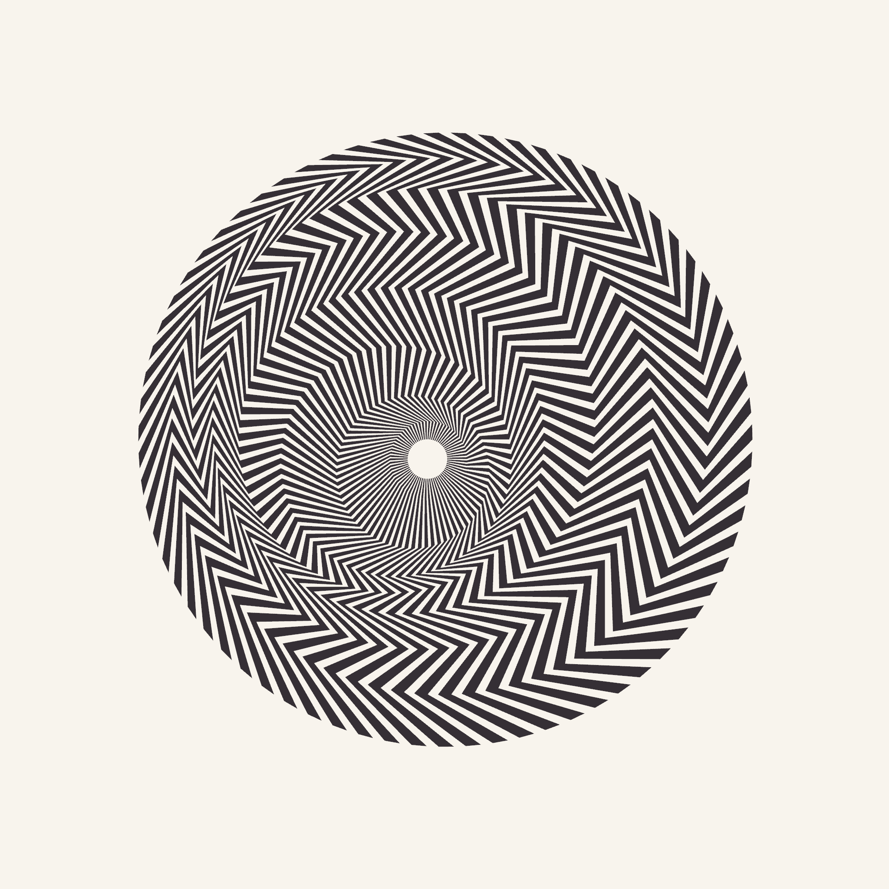

## Kate Y:

https://editor.p5js.org/kateyourke/sketches/Dzl2cGxgX

I tried to follow this premise of Bridget Riley’s work (in the quote below) by making a pattern (with a slight nod to weaving) and having it disappear, leaving an after-effect of opposite colors which then fades - then I meant for the piece to run backwards but with my rudimentary understanding I ran out of time before I could get it to work…

“The basis of my paintings is this: that in each of them a particular situation is stated. Certain elements within that situation remain constant. Others precipitate the destruction of themselves by themselves.Recurrently, as a result of the cyclic movement of repose, disturbance and repose, the original situation is re-stated…” Bridget Riley
