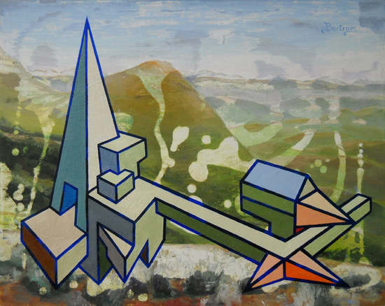
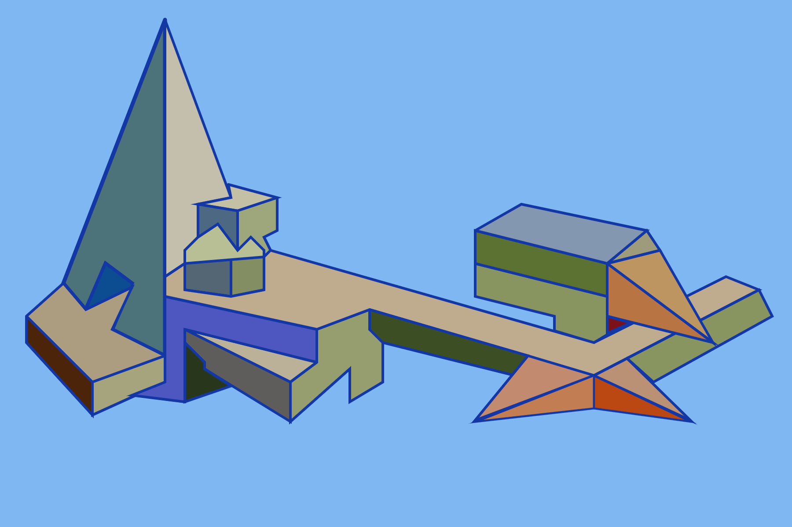
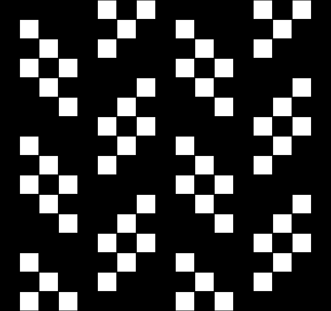
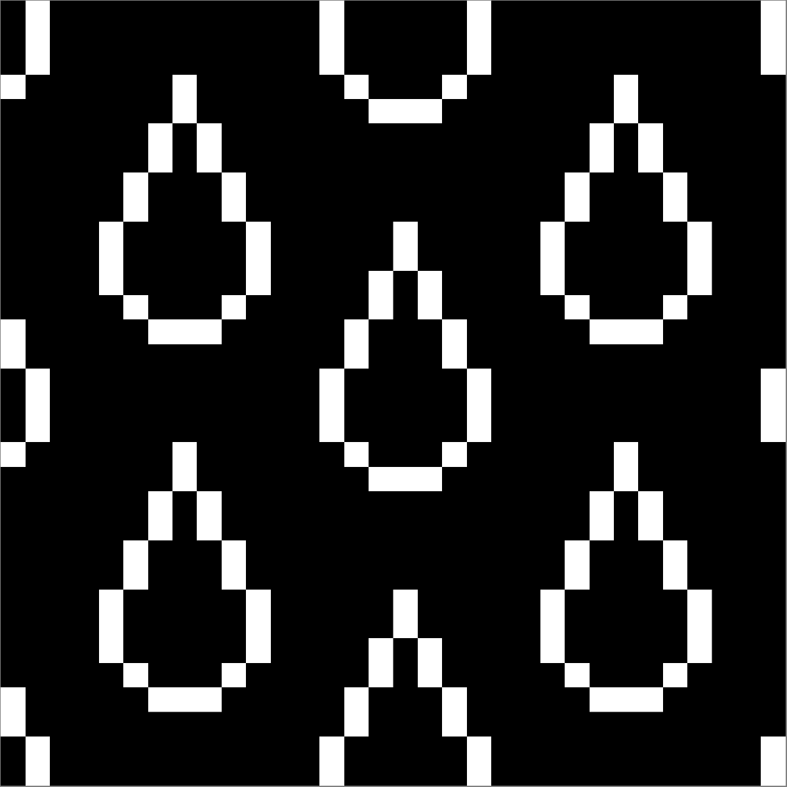
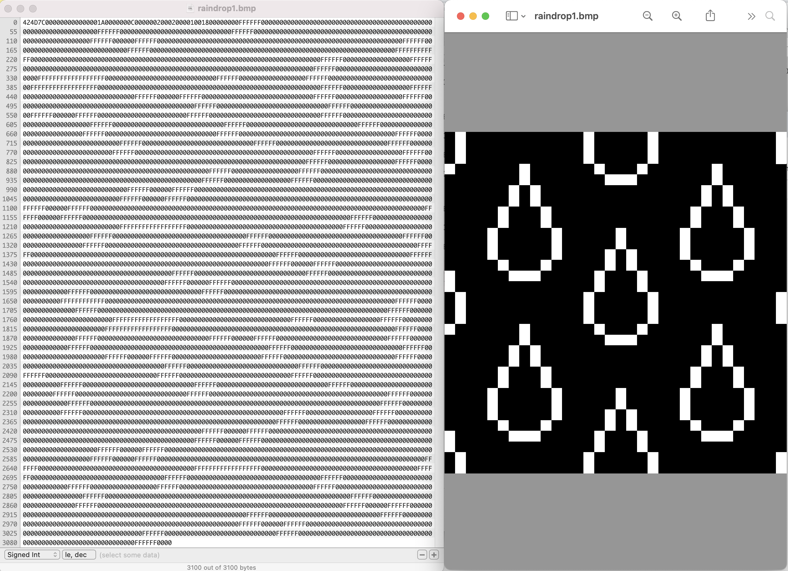
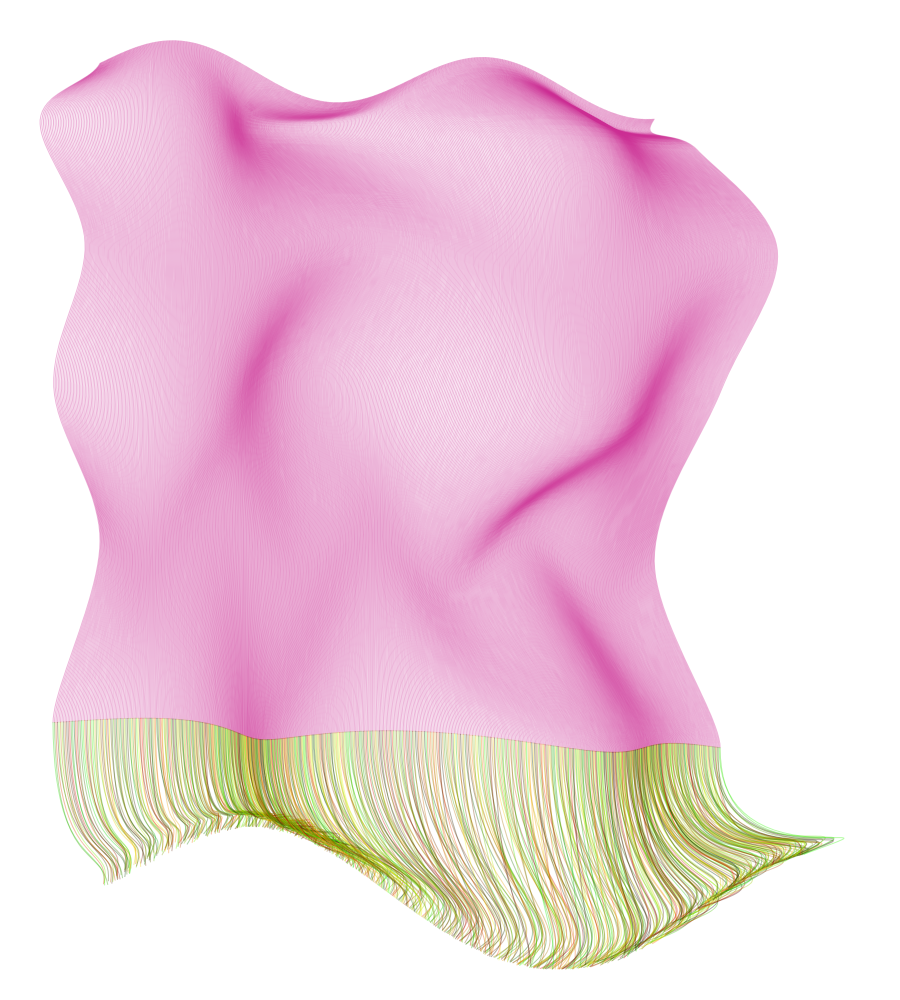
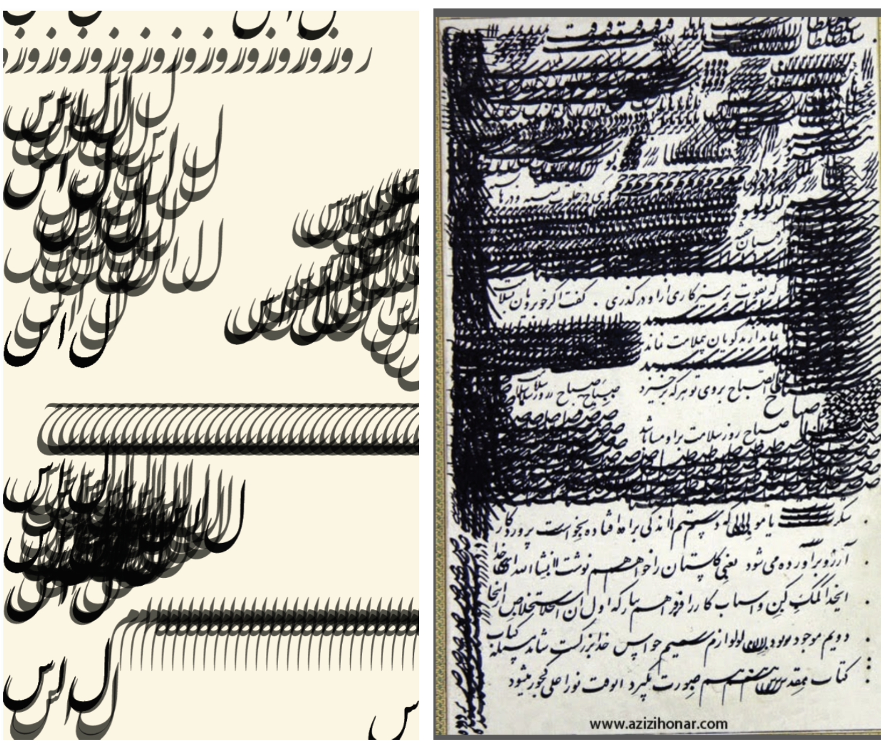
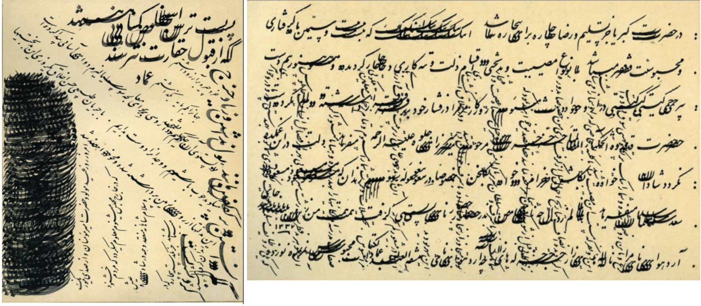
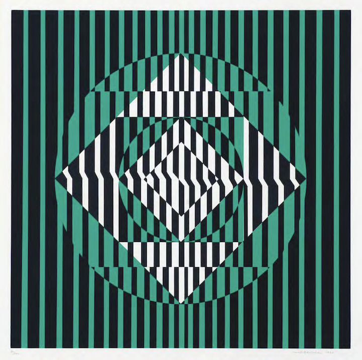
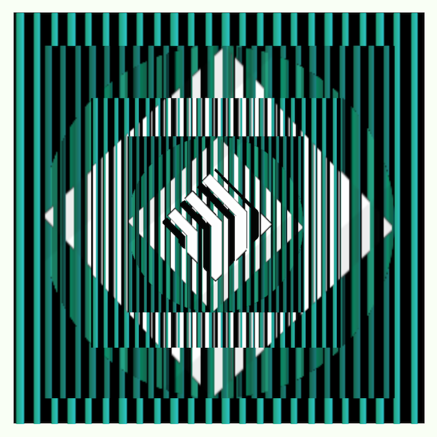

# HW_ Week 8

## Matthis G

I chose to make a reproduction of a Julian Stanczak painting called *Connecting* from 1967. The form of the painting is reasonably straightforward, although it was difficult to make the composition feel correctly weighted. The real challenge was getting the apparent colours to appear the same. There is a grid of blue dots covering the entire image, that changes the hue of both the background and foreground colours. I’m still not entirely happy with my copy, but I tried printing it to get a better idea of what it looks like.  

Original:

Recreation:

## Lillian B

I chose to recreate one of my father’s artworks by making it a mix of his *Skyships Reclaimed* and *Bouquet Skyships* series.

Original:

Recreation attempt in p5js:

Live code: https://editor.p5js.org/lllyyybbb/sketches/hAI95HIS7

## Jenna Murphy:

**Artist 1: Susan Kare**

Original:

Recreation:

https://editor.p5js.org/jennamurphymcad/sketches/tLK81Axbq

https://editor.p5js.org/jennamurphymcad/sketches/n1_WzEqhF

**Artist 2: Roman Verostko**

Original:

Recreation:

https://editor.p5js.org/jennamurphymcad/full/Qfr3JGNRb

## Sara:

Recreation of a kinetic poem from Issue 9 of the electronic publication “The Alchemist”

Original:

https://drive.google.com/file/d/1Q8dj_qJidQf3u1vQY4hQyFX4HDbb5wTJ/view?usp=sharing

Recreation:

**Some links of interest:**

- The Alchemist 9, electronic issue simulation: https://archive.org/details/thealchemist_electronicissue
- Apple II emulator: https://www.scullinsteel.com/apple2/#jed
- Word Dance by Richard M. O Donnell (an essay on electronic creative writing):  https://drive.google.com/file/d/1on3wu9gNyzpk7wLY2Md4tRSa6YO-Xlty/view?usp=sharing

## Kate Y:

I explored a lot of artists but I didn’t feel so engaged with their work until I found Marisa Gonzalez:

My reenactment of Marisa Gonzalez La Negrona Diapo3

In this series she creates images of herself, to compare to an ideal self for which she uses the photo of the only black woman to appear in a Chicago newspaper (image below)

I used a screen shot from my Visual Music video project and camera capture with invert, trying to keep my face in the dark with the background light [https://editor.p5js.org/kateyourke/full/lzz-x6OEk](https://editor.p5js.org/kateyourke/full/lzz-x6OEk)  I would have liked to recreate the degraded texture of the white silhouette in the original

**Marisa Gonzalez**
Born in Bilbao, she moved to United States to study a [Master’s degree](https://en.wikipedia.org/wiki/Master%27s_degree) at the [School of the Art Institute of Chicago](https://en.wikipedia.org/wiki/School_of_the_Art_Institute_of_Chicago) (SAIC) where she specialized in the use of [new technologies](https://en.wikipedia.org/wiki/Information_and_communications_technology) applied to the artistic practices in the department of [Generative Systems](https://en.wikipedia.org/wiki/Generative_systems) where she studied with the founder, [Sonia Landy Sheridan](https://en.wikipedia.org/wiki/Sonia_Landy_Sheridan)

https://www.rtve.es/play/videos/metropolis/metropolis-marisa-gonzalez/3552118/?media=tve

In 1992, she directed in the [Circle of Fine Arts](https://en.wikipedia.org/wiki/C%C3%ADrculo_de_Bellas_Artes) of Madrid a workshop of Contemporary Art called *The poetic of technology,* along with the American artist Sonia Sheridan, John Dunn and Jamy Sheridan. The following year, together with her students, she made the *Station Fax/Fax Station*, an interactive installation that works through [Fax](https://en.wikipedia.org/wiki/Fax) machines. This same year she began the series, *Clónicos*, in which she uses dolls in reference to the human body. This full series were made with the photo-video-computer Lumena, invented by John Dunn and donated to Gonzalez by Sonia Sheridan.[[9]](https://en.wikipedia.org/wiki/Marisa_Gonzalez#cite_note-9)

> [Inicio](http://marisagonzalez.com/)

**Diapo3**
In 1992, Marisa Gonzalez was invited by Canon to investigate the new BJ-A1, the first large format copier. This new machine reproduced the image with ink instead of coated paper or toner. The results of this research were a platform to interconnect all the techniques that the copiers bring us, to apply the development of these new technological territories to her creativity. With this new technique she generates a new series based on the only image of a black woman founded in a newspaper in Chicago in the 70s.

It is a dialogue between her real and ideal selves

Was Sonia Sheridan who created the GS department, to offer students a platform to investigated with her through her research, the intellectual, conceptual and artistic content and magnitude, from using new technologies to create art escaping from the «just a copy» idea.

1992 in Madrid during seven days, the workshop-computer-video-performance «Time Space» with the Lumena inventor John Dunn, Sonia Sheridan, Jamy Sheridan and Marisa Gonzalez at the Circle of Fine arts at her workshop «The poetic of technology».

1990 City Portraits, Fax-Art

Fax-Art

Palabras vivas Net Art: [https://youtu.be/-CT32Tn2Tfc](https://youtu.be/-CT32Tn2Tfc)

La fabrica Net Art: The task in this web site is to to open an interactive strategy of participation and communication on line. Send images and texts of relevant factories on a certain industrial arquitecture in process of destruction or abandoned, related to your own experience, in your neighborhood, family or any other kind. A computer will be open in the exhibition gallery, to receive information from all the interested parties who want to be involved in the project. All participants will be included in this project and could be visited in the web page.

(I appreciated her attempt to engage people in a public project acknowledging these formerly industrial buildings and neighborhoods)

«El mensaje del Kanga», Galería Evelyn Botella de Madrid

> They are women who have little voice, and this is a form of communication."

(I also relate to her interest in how African women use textiles for communication, and in empowering women in Africa and elsewhere)

**Sonia Landy Sheridan**

In the 1960s, Sonia Landy Sheridan began to teach at the School of the Art Institute of Chicago, where in 1970 she founded a new department called Generative Systems, focused on the investigation of artistic use of new technologies emerging in that period.

Sonia Landy Sheridan explored the artistic possibilities of the Color-in-Color during a residency at 3M in 1970. The exhibition *Software*, organised by Jack Burnham during the same year at the Jewish Museum (New York, NY, U.S.), allowed Sheridan to introduce the photocopier to the general public (she collaborated on this initiative with Don Conlin and Douglas Dybvig). As a follow-up, Sheridan convinced the Art Institute to rent and eventually acquire a C-in-C on an instalment payment plan. The tool became a vital component of the Generative Systems course until 1972 (at which time 3M took the photocopier back). Sheridan and her students made full use of the copier’s functionalities, by, for example, drawing on the flexibility of its internal controls to increase the density of the colours and by using the machine in conjunction with other devices (Polaroid camera, video monitor, frequency generator, biofeedback system). In 1971, Douglas Dybvig of 3M initiated Sheridan on the prototype of the C-in-C II. Unlike the first C-in-C model, which was limited to a 1 = 1 reproduction of the original, the Color-in-Color II created large format prints from negatives and slides.

[Interactive links](https://www.fondation-langlois.org/html/e/page.php?NumPage=1991) for Sonia Landy Sheridan’s course in Generative Systems

[**Mila Gravenhorst**](http://dada.compart-bremen.de/item/agent/636)

Fotomechanische Transformation 1967

[**Sylvia Roubaud**](https://www.roubaud.de/)

[Sylvia Roubaud](https://www.roubaud.de/) took part in an art project initiated and sponsored by the aircraft company Messerschmitt-Boelkow-Blohm (MBB). The group was named »MBB Computer Graphics«. Dr. Winfried Fischer, head of MBB´s cultural department, formed a project group involving an artist and four computer graphic specialists.

The project group´s computer-generated works were intended to be a contribution to the cultural program of the 1972 Olympics in Munich. The plotter drawings were reproduced in various printing techniques and print runs for exhibitions and the book »Computer Graphics« edited by Johann Willsberger in 1972.

[**Barbara Nessim**](http://barbaranessim.squarespace.com/1980s-computer)

[**Elga Morgenstern-Hübner**](http://dada.compart-bremen.de/item/artwork/1409)

Coku Brotlos ist die Kunst | Coku art is breadless 1985

**CTG Japan** Computer Technique Group
[Koji Fujino](http://dada.compart-bremen.de/item/agent/264) / [Junichiro Kakizaki](http://dada.compart-bremen.de/item/agent/265) / [Masao Kohmura](http://dada.compart-bremen.de/item/agent/246) / [Fujio Niwa](http://dada.compart-bremen.de/item/agent/266) / [Makoto Ohtake](http://dada.compart-bremen.de/item/agent/267)

[http://lansdown.mdx.ac.uk/CAS/page/PAGE66.pdf](http://lansdown.mdx.ac.uk/CAS/page/PAGE66.pdf)

*Running Cola is Africa* was created by members of the Computer Technique Group in late 1967 or early 1968.

[**Atsuhiko Iwakoshi**](http://dada.compart-bremen.de/item/agent/707)

(work sample 5)

**Manuel Barbadillo**

*‘TRPTICO’, 1966; acrylic on canvas – 3 panels – 66×66 inches*

[http://www.atariarchives.org/artist/sec13.php](http://www.atariarchives.org/artist/sec13.php)

In 1968, I began computer research on my own painting, with the collaboration of the then newly-opened Centro de Cálculo de la Universidad de Madrid. My search for an objective language in my painting had led me already—through the practically total elimination of the subjective elements—to repetitions of a single shape in black and white compositions. I have explained my work with the computer in my articles ‘El Ordenador,’ published in the already mentioned publication, and ‘Modules, Structures and Relationships; Ideograms of Universal Rapport,’ of which a condensed version has been published in English.2

Currently, my work is based on a series of elementary shapes, or modules—four generally—which are the alphabet I build my pictures with. The definition of these shapes in a square is absolutely objective, and when repeated in a grid in various positions, they may originate an infinity of different designs. Their number depends on the squares in the grid as well as on the number of modules employed.

Starting with these modules, I try to express myself as the poet does with words or the composer with notes; by combining them so as to create a rhythmic pattern.

Basically, my painting is a research on the problem of space, which in my work is an element hierarchically equal to form, like a complementary form or antiform, in the same way that silence—pauses—in music, is a modulating element as important as sound, with ‘form’ being neither one or the other but the result of combinations between both of them.

In my pictures, space, rather than being a neutral element—a mere support for form—is a participating one, and the paintings, rather than of form and background, are composed of positive modules (black on white) and negative ones (white on black). This principle of oppositions and complementary opposites is essential in my work. It is present from the level of independent modules to that of very complex compositions. I believe it to be a statement on the bipolarity or dual nature of things, a notion antiquity held as the golden rule of the Universe.

The computer has been a great help to me. Properly programmed it will produce a great number of designs to study and compare, to choose or to get a stimulus from. It has revealed compositional rules I had been using in my pictures without being really conscious of them, and has allowed a great deal of systematization in my work. Since I use it more as a help for research than as a tool for execution, and am thus more interested in speed than in perfection of drawing, I prefer a line printer—with asterisks roughly filling the shapes—to a plotter. The final versions of my works I usually produce by hand.

*Torremolinos, Spain*
*August 1975*

[**Francois Morellet**](https://www.studiointernational.com/index.php/francois-morellet-interview-art-is-frivolous-even-when-it-takes-itself-seriously)

*François Morellet. 3 Trames de carrés réguliers pivotés sur le côté, 1970*

https://www.wikiart.org/en/francois-morellet/4-trames-de-tirets-pivot-es-sur-un-c-t-1971

Untitled (Verticals and Horizontals) (1970)

I thought this poetry engine would be interesting to recreate:

> Alison Knowles
> A house of dust
> On open ground
> Lit by natural light
> Inhabited by friends and enemies
> Alison Knowles, The House of Dust, 1967

[Click to access HOUSE_OF_DUST_JOURNAL_25_08_2016_BDEF_PREVIEW.pdf](https://www.artbytranslation.org/abtweb/publications/HOUSE_OF_DUST_JOURNAL_25_08_2016_BDEF_PREVIEW.pdf)

[https://www.artbytranslation.org/abtweb/publications/HOUSE_OF_DUST_JOURNAL_25_08_2016_BDEF_PREVIEW.pdf](https://www.artbytranslation.org/abtweb/publications/HOUSE_OF_DUST_JOURNAL_25_08_2016_BDEF_PREVIEW.pdf)

*The House of Dust* installed at the Valencia campus, CalArts, 1971.

In 1967, Knowles collaborated with composer James Tenney to create an early example of computer-generated poetry and artificial intelligence. The poem was based on four lists composed by the artist. The lists described a house in short word sequences: the type of house and building materials (1), the lighting (2), the location or the surrounding area (3), and the inhabitants (4). The sentence fragments were coded using the programming language FORTRAN IV and transformed into a fifty-page, randomly generated, computer-based poem by a Siemens computer from the Brooklyn Collegiate and Polytechnic Institute four lists beginning with “a house of” followed by a randomized sequence of a material, a site or situation, a light source, and a category of inhabitants.

> A HOUSE OF WOOD
> UNDER WATER
> USING NATURAL LIGHT
> INHABITED BY FRIENDS
> A HOUSE OF LEAVES
> IN A METROPOLIS
> USING ALL AVAILABLE LIGHTING
> INHABITED BY ALL RACES OF MAN REPRESENTED WEARING PREDOMINANTLY RED CLOTHING
> A HOUSE OF ROOTS
> IN AN OVERPOPULATED AREA
> USING ELECTRICITY
> INHABITED BY HORSES AND BIRDS…
> A HOUSE OF WOOD
> IN A METROPOLIS
> USING ELECTRICITY
> INHABITED BY FRIENDS AND ENEMIES

[wayback machine with links to algorithmic text experiments](https://web.archive.org/web/20030402043243/http://www.sharemation.com/~bravedog/cyberdelia5.htm)

Jamy Sheridan was a student in Sonia Landy Sheridan’s Generative Systems program at the School of the Art Institute of Chicago.

Each of the works documented here consists of two major components. The visual component is a real-time computer animation projected onto a bed of white sand on the floor in a visually and acoustically isolated space. The audio component, which was generated in real-time but is usually presented on a CD, is synthesized music created by [John Dunn](https://web.archive.org/web/20031202025030/http://www.algoart.com/) and driven by DNA and protein data.  In each work, the audio and visual components relate to each other structurally and conceptually.  The *Garden of Initial Conditions* is ‘written’ in *Wonk,* a real-time, direct manipulation performance language for artists.  Wonk was designed by John Dunn with Jamy Sheridan.  All the works shown here were created using software written by John Dunn.  The still images shown here are time exposures  taken at various intervals with the animation paused.

I had heard of Laurie Spiegel’s music and her Music Mouse program, but I was surprised by these intriguing computer graphics

**Laurie Spiegel**

After beginning to use them for music, I realized that the computer is a sort of Rossetta Stone for the arts. Techniques learned for music (programming, learning to describe abstract structures and processes in artificial languages) are applicable to alternative sensory modalities of input/output in an unprecedented way. (All the guitar chops in the world won’t help you much with a paint brush.)

So, of course, I wrote myself what’s now called a “paint” program (one of the first, at [Bell Labs](https://web.archive.org/web/20040602200837fw_/http://www.retiary.org/ls/btl/btl.html) in 1974), then made lots of [still images](https://web.archive.org/web/20040602200837fw_/http://www.retiary.org/ls/btl/ls_btl_art.html) using it. I also [interfaced it](https://web.archive.org/web/20040602200837fw_/http://www.retiary.org/ls/writings/vampire.html) with time structuring software I was already using for music composition, and was able to generate output to video and film in the following years.

I created the following images (and many more) in 1974-1976 using a Rand Tablet and FORTRAN IV software I wrote that, at the time, I called “a drawing program”. The same software would now be called “a paint program” because, in the 1980s, the word “drawing” came to be construed as refering to vector, rather than raster, image creation software.

Laurie Spiegel with the hardware end of GROOVE’s digital-analog hybrid architecture
[History of Laurie Spiegel’s Music Mouse](https://web.archive.org/web/20030402043243/http://www.sharemation.com/~bravedog/cyberdelia5.htm)

# Ladan

Recreation and Original:

# Mau.

Matilde Perez

 Untitled 1972 (original)
 Untitled 2022 (recreation)

